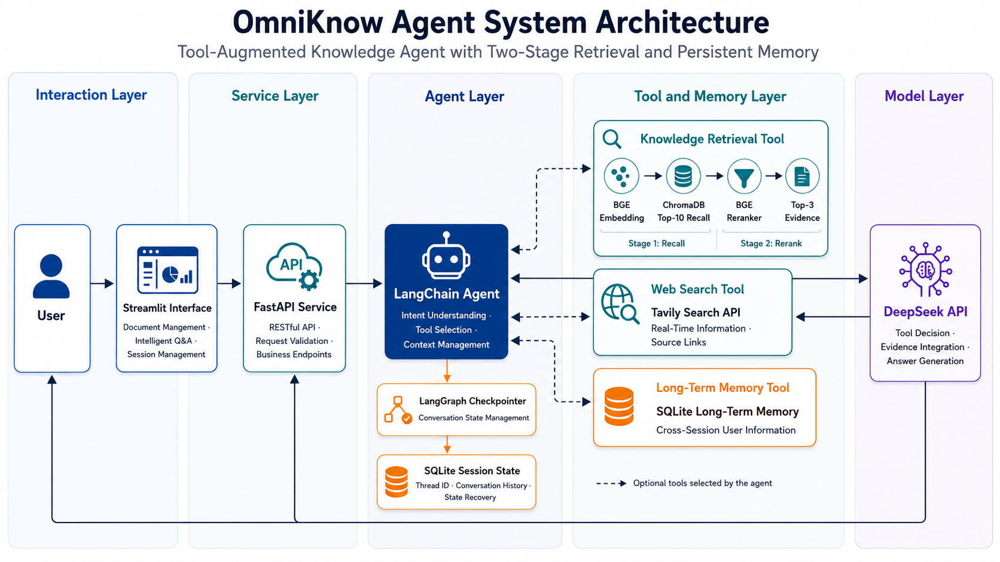
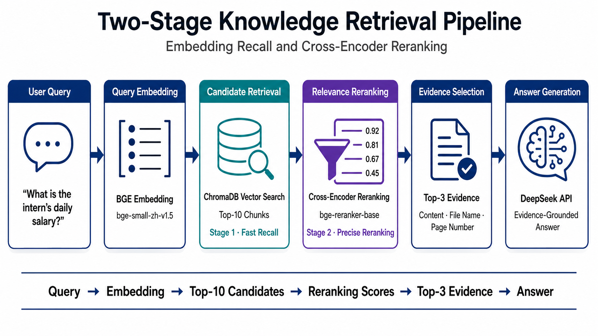

# OmniKnow Agent

> 一个具备本地知识检索、工具调用、联网搜索与持久化记忆能力的知识库智能体。

OmniKnow Agent 是一个面向个人知识管理与文档问答场景构建的 Agent 应用。项目基于 DeepSeek、LangChain、ChromaDB 和 FastAPI，实现了从 PDF 文档入库、两阶段知识检索到答案生成的完整 RAG 流程，并使用 LangGraph Checkpointer 与 SQLite 持久化会话状态。

不同于仅执行一次检索链的普通知识库问答系统，OmniKnow Agent 可以根据用户意图自主选择知识库检索、文档总结、文档列表、联网搜索和长期记忆等工具，同时支持多轮对话、历史会话恢复及跨会话长期记忆。

## 核心能力

### 文档知识库

- 支持 PDF 文档上传、解析与文本切分
- 使用 BGE Embedding 生成文本向量
- 使用 ChromaDB 持久化存储文档向量
- 支持重复文档检测
- 支持已入库文档查询与删除
- 支持指定文档的整体总结
- 保留文本块对应的文件名与页码信息

### 两阶段检索

- 第一阶段使用向量相似度召回候选文本块
- 第二阶段使用 Cross-Encoder Reranker 重排序
- 将高相关性证据交给大语言模型生成回答
- 回答知识库问题时返回文件名与页码来源

### Agent工具调用

- 基于 LangChain 构建多工具 Agent
- 根据用户意图自主选择工具
- 区分知识库查询、文档总结、联网搜索和记忆操作
- 使用 LangGraph Checkpointer 管理会话状态
- 记录当前轮次的工具调用情况
- 避免直接依赖大模型内部知识回答本地文档问题

### 双层记忆机制

- 使用 LangGraph Checkpointer 保存完整会话状态
- 使用 SQLite 实现会话状态跨服务重启恢复
- 通过 `thread_id` 隔离不同对话
- 支持历史会话查询、恢复与继续对话
- 使用独立 SQLite 数据库保存跨会话长期记忆
- 支持长期记忆的新增、更新、查询和删除

### 应用服务

- FastAPI 后端接口
- Streamlit 交互界面
- PDF 上传与知识库管理
- 历史会话查询与恢复
- 长期记忆查询与管理
- Shell 脚本一键启动前后端服务

## Agent工具

| 工具名称 | 主要功能 | 典型使用场景 |
|---|---|---|
| `knowledge_search` | 检索本地知识库 | 查询文档中的具体事实 |
| `knowledge_document_list` | 查询已入库文档 | 查看知识库包含哪些文件 |
| `document_summary` | 读取并总结指定文档 | 总结论文、通知书或报告 |
| `web_search` | 搜索实时互联网信息 | 查询新闻、项目和时效性信息 |
| `save_user_memory` | 保存或更新长期记忆 | 记住用户称呼、研究方向或偏好 |
| `get_user_memories` | 查询长期记忆 | 跨会话读取已保存的信息 |
| `delete_user_memory` | 删除指定长期记忆 | 清除不再需要的用户信息 |

LangChain Agent 会结合系统提示词、用户问题和工具描述，自主决定是否调用工具以及调用哪一个工具。

例如：

```text
通知书中实习生的日薪是多少？
→ knowledge_search

知识库里有哪些文件？
→ knowledge_document_list

请总结BIBM.pdf的主要内容。
→ document_summary

请搜索最近的LangGraph开源项目。
→ web_search

请记住，我的研究方向是大语言模型。
→ save_user_memory

我的研究方向是什么？
→ get_user_memories
```

## 系统架构

OmniKnow Agent 采用分层架构，将交互界面、API 服务、Agent 编排、工具调用、知识检索与持久化记忆进行解耦。

LangChain Agent 根据用户意图自主选择知识库检索、联网搜索或长期记忆等工具，并调用 DeepSeek 完成工具决策、信息整合与回答生成。会话状态通过 LangGraph Checkpointer 和 SQLite 进行持久化。

<p align="center">
  
</p>

整体调用关系如下：

```text
用户
→ Streamlit交互界面
→ FastAPI后端服务
→ LangChain Agent
→ 工具调用与DeepSeek回答生成
```

其中，会话状态的保存关系为：

```text
LangChain Agent
→ LangGraph Checkpointer
→ SQLite会话数据库
```

## 知识库问答流程

项目采用向量召回与 Cross-Encoder 重排序相结合的两阶段检索方案。

首先使用 BGE Embedding 对用户问题进行向量化，并从 ChromaDB 召回 Top-10 候选文本块；随后使用 BGE Reranker 重新计算问题与候选文本之间的相关性，选择 Top-3 证据交给 DeepSeek 生成回答。

<p align="center">
  
</p>

完整执行过程如下：

1. 使用 `bge-small-zh-v1.5` 对用户问题进行向量化。
2. 从 ChromaDB 中召回向量距离最接近的 Top-10 文本块。
3. 使用 `bge-reranker-base` 联合编码用户问题与候选文本。
4. 根据 Reranker 相关性分数重新排列候选文本。
5. 保留得分最高的 Top-3 证据。
6. 将证据内容、文件名和页码返回给 Agent。
7. DeepSeek 根据用户问题与检索证据生成最终回答。

Embedding 模型适合从大量文本块中快速召回候选内容，Reranker 则进一步判断问题与候选文本之间的相关性，从而改善最终证据的排序质量。

## 记忆机制

OmniKnow Agent 将记忆分为会话记忆和用户长期记忆。

### 会话记忆

会话记忆用于保存同一个对话中的完整消息状态，包括用户消息、Agent回答和工具调用过程。

项目将 LangGraph `SqliteSaver` 作为 LangChain Agent 的 Checkpointer，通过 SQLite 持久化 Agent 状态，并使用 `thread_id` 区分不同会话。

支持：

- 多轮对话上下文理解
- 不同会话之间的状态隔离
- 服务重启后恢复历史会话
- 查看历史会话列表
- 恢复并继续已有会话

默认保存位置：

```text
data/memory/conversation_memory.db
```

每次调用 Agent 时，都会将当前会话的 `thread_id` 传给 Checkpointer：

```python
config={
    "configurable": {
        "thread_id": thread_id,
    }
}
```

相同的 `thread_id` 会继续读取原有会话状态，不同的 `thread_id` 则对应不同的对话。

### 长期记忆

长期记忆用于保存需要跨会话使用的稳定用户信息，例如：

- 用户姓名或称呼
- 研究方向
- 回答偏好
- 长期项目背景

长期记忆不依赖当前 `thread_id`。即使用户新建对话，Agent 仍然可以通过长期记忆工具读取已保存的信息。

支持：

- 保存新记忆
- 更新已有记忆
- 查询全部记忆
- 删除指定记忆

默认保存位置：

```text
data/memory/long_term_memory.db
```

当前版本使用单用户配置：

```text
default-user
```

长期记忆只会在用户明确表达“请记住”“以后记得”或“保存这个信息”等意图时写入，不会自动保存每一条聊天内容。

## 技术栈

| 模块 | 使用技术 |
|---|---|
| Agent构建与工具调用 | LangChain |
| 大语言模型 | DeepSeek API |
| 会话状态管理 | LangGraph Checkpointer |
| 后端服务 | FastAPI、Uvicorn |
| 交互界面 | Streamlit |
| 向量数据库 | ChromaDB |
| Embedding | BAAI/bge-small-zh-v1.5 |
| Reranker | BAAI/bge-reranker-base |
| 联网搜索 | Tavily Search API |
| 会话持久化 | LangGraph SqliteSaver、SQLite |
| 长期记忆 | SQLite |
| PDF解析 | PyPDFLoader |
| 文本切分 | RecursiveCharacterTextSplitter |

## 项目结构

```text
omniknow-agent/
├── app/
│   ├── agent/
│   │   └── knowledge_agent.py
│   ├── api/
│   │   └── main.py
│   ├── memory/
│   │   ├── long_term_memory.py
│   │   └── session_store.py
│   ├── rag/
│   │   ├── ingest.py
│   │   ├── qa.py
│   │   ├── reranker.py
│   │   └── retriever.py
│   └── tools/
│       └── web_search.py
├── assets/
│   ├── omniknow-architecture.png
│   └── two-stage-retrieval.png
├── data/
│   ├── chroma/
│   ├── memory/
│   └── uploads/
├── models/
│   ├── bge-small-zh-v1.5/
│   └── bge-reranker-base/
├── frontend.py
├── start.sh
├── requirements.txt
├── .env.example
├── .gitignore
└── README.md
```

模型文件、上传文档、向量数据库、记忆数据库和日志不会提交到 GitHub，需要在本地运行时自动创建或单独下载。

## 环境要求

推荐使用以下环境：

- Python 3.11
- Conda
- CUDA GPU，可选
- DeepSeek 或兼容 OpenAI 接口的大模型服务
- Tavily API Key

Embedding 模型可以在 CPU 上运行。Reranker 同样支持 CPU，但推荐使用 CUDA GPU 以降低检索延迟。

## 快速开始

### 1. 克隆项目

```bash
git clone https://github.com/chenqianqian-k/omniknow-agent.git
cd omniknow-agent
```

### 2. 创建Conda环境

```bash
conda create -n knowledge-agent python=3.11 -y
conda activate knowledge-agent
```

### 3. 安装PyTorch

请根据本机 CUDA 环境安装对应版本的 PyTorch。

安装完成后检查：

```bash
python -c "import torch; print('PyTorch:', torch.__version__); print('CUDA available:', torch.cuda.is_available())"
```

### 4. 安装项目依赖

```bash
pip install -r requirements.txt
```

## 下载本地模型

模型权重不保存在 GitHub 仓库中，需要下载到项目的 `models` 目录。

### 下载Embedding模型

```bash
python -c "from modelscope import snapshot_download; snapshot_download('BAAI/bge-small-zh-v1.5', local_dir='models/bge-small-zh-v1.5')"
```

### 下载Reranker模型

```bash
python -c "from modelscope import snapshot_download; snapshot_download('BAAI/bge-reranker-base', local_dir='models/bge-reranker-base')"
```

下载完成后的目录结构：

```text
models/
├── bge-small-zh-v1.5/
└── bge-reranker-base/
```

## 配置环境变量

复制环境变量示例文件：

```bash
cp .env.example .env
```

然后填写 `.env`：

```env
DEEPSEEK_API_KEY=your_deepseek_api_key
DEEPSEEK_BASE_URL=https://your-api-provider.example.com/v1
DEEPSEEK_MODEL=your_model_name

TAVILY_API_KEY=your_tavily_api_key

RERANKER_DEVICE=cuda:0
```

`.env` 中包含真实密钥，禁止将其上传到 GitHub。

## 启动项目

为启动脚本添加执行权限：

```bash
chmod +x start.sh
```

一键启动前后端：

```bash
bash start.sh
```

启动完成后访问：

- Streamlit 前端：`http://localhost:6008`
- FastAPI 接口文档：`http://localhost:6006/docs`
- 后端健康检查：`http://localhost:6006/health`

按下 `Ctrl+C` 可以同时停止后端和前端服务。

## 手动启动

如果不使用启动脚本，可以分别启动后端和前端。

### 启动FastAPI

```bash
uvicorn app.api.main:app \
    --host 0.0.0.0 \
    --port 6006
```

### 启动Streamlit

```bash
streamlit run frontend.py \
    --server.address 0.0.0.0 \
    --server.port 6008
```

在 AutoDL 等远程服务器中运行时，需要同时配置对应的端口映射。

## API接口

| 请求方法 | 接口路径 | 功能 |
|---|---|---|
| `GET` | `/` | 获取服务基本信息 |
| `GET` | `/health` | 检查后端服务状态 |
| `POST` | `/chat` | 与Agent进行对话 |
| `POST` | `/documents/upload` | 上传并写入PDF文档 |
| `GET` | `/documents` | 查询已入库文档 |
| `DELETE` | `/documents` | 删除知识库文档 |
| `GET` | `/sessions` | 查询历史会话 |
| `GET` | `/sessions/{thread_id}` | 获取指定会话消息 |
| `GET` | `/memories` | 查询用户长期记忆 |
| `DELETE` | `/memories/{memory_key}` | 删除指定长期记忆 |

完整接口参数可以在后端服务启动后通过 Swagger UI 查看：

```text
http://localhost:6006/docs
```

## 使用示例

### 查询文档内容

```text
通知书中的工作地点在哪里？
```

Agent 将调用：

```text
knowledge_search
```

### 查看知识库文档

```text
知识库里有哪些文件？
```

Agent 将调用：

```text
knowledge_document_list
```

### 总结完整文档

```text
请总结BIBM.pdf的主要内容。
```

Agent 将调用：

```text
document_summary
```

### 搜索实时信息

```text
请搜索最近的LangGraph开源项目，并提供来源链接。
```

Agent 将调用：

```text
web_search
```

### 保存长期记忆

```text
请记住，我的研究方向是大语言模型和多模态学习。
```

Agent 将调用：

```text
save_user_memory
```

### 跨会话读取记忆

新建对话后输入：

```text
我的研究方向是什么？
```

Agent 将调用：

```text
get_user_memories
```

## 数据安全

以下内容通过 `.gitignore` 排除，不会提交到 GitHub：

```text
.env
models/
data/uploads/
data/chroma/
data/memory/
logs/
*.pdf
*.db
*.sqlite
```

上传代码前仍建议检查待提交文件：

```bash
git status
```

如果 API Key 曾经被误上传到 GitHub，仅删除对应文件并不足以保证安全，还需要立即废弃原密钥并创建新密钥。

## 当前限制

- 当前主要支持单用户使用
- 长期记忆使用固定的 `default-user`
- 当前仅支持 PDF 文档
- 长文档总结受到最大文本块数量限制
- DeepSeek 与 Tavily 功能依赖外部 API
- 本地 Embedding 和 Reranker 模型需要单独下载
- 当前不包含用户登录、权限认证和访问控制
- 文档解析暂未针对扫描版 PDF 集成 OCR

## 后续计划

- 支持 Word、Markdown、TXT 等文档格式
- 增加多用户身份认证与数据隔离
- 支持流式输出 Agent 回答
- 增加异步文档解析与任务状态查询
- 增加检索结果置信度控制
- 增加知识库检索与工具路由评估
- 使用 Docker 完成项目环境封装

## 项目定位

本项目主要用于学习和实践以下技术：

- RAG知识库问答流程
- LangChain Agent构建与多工具调用
- LangGraph Checkpointer会话状态持久化
- 两阶段文本检索
- 长短期记忆管理
- FastAPI服务开发
- 大模型应用工程化部署

## License

本项目用于个人学习、技术实践与项目展示。
